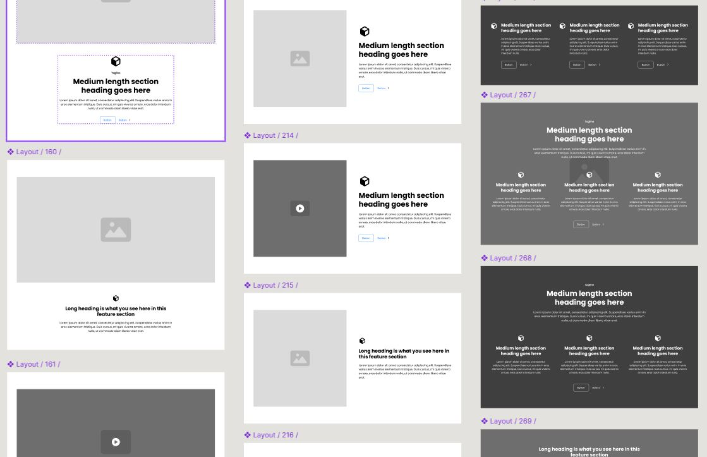
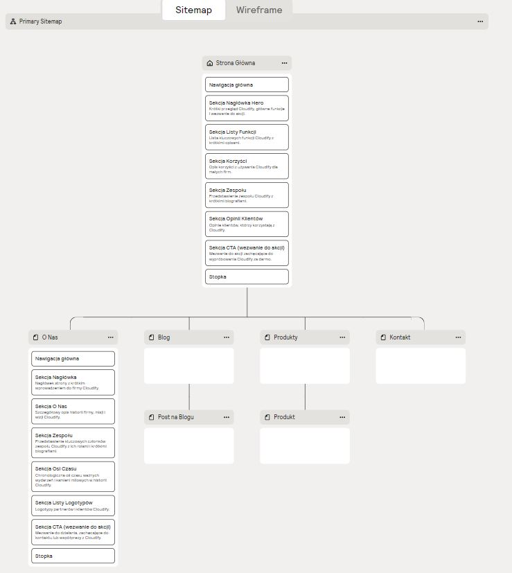
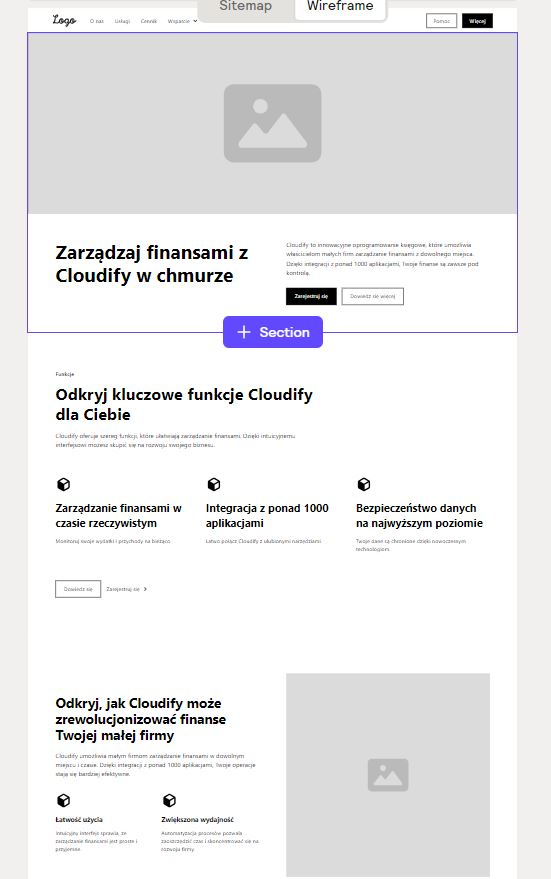

## Relume – narzędzie, które przyspiesza proces tworzenia stron internetowych

<a href="https://www.relume.io/" rel="nofollow" target="_blank">Relume</a> to innowacyjne narzędzie, które pomaga projektantom i programistom w szybkim budowaniu stron internetowych. Według mnie najważniejszym atutem tego narzędzia jest biblioteka gotowych komponentów, które można łatwo dostosować do swoich potrzeb. Dzięki temu zamiast tworzyć każdy element strony od zera, możemy korzystać z gotowych, profesjonalnie zaprojektowanych modułów.

Co więcej, aktualnie relume oferuje także tworzenie strony przy pomocy AI, gdzie wystarczy w kilku zdaniach opisać swoją firmę i dostaniemy strukturę strony - układ podstron z propozycją sekcji, a w kolejnym kroku także konkretne układy sekcji z odpowednimi tekstami na każdą z podstron!

## Dlaczego warto korzystać z Relume?

Głównym celem Relume jest przyspieszenie procesu projektowania i zapewnienie większej elastyczności twórcom stron. Oto kluczowe zalety tego narzędzia:

- Gotowe siatki i szablony – zamiast ręcznie tworzyć każdy element strony, mamy dostęp do gotowych układów, które możemy modyfikować.
- Wykorzystanie AI do generacji siatki strony, układu i treści poszczególnych podstron
- Integracja z Figma – relacja między Relume a Figma pozwala na błyskawiczne tworzenie layoutów bez potrzeby wychodzenia z aplikacji.
- Profesjonalne komponenty – gotowe elementy, takie jak hero sekcje, nagłówki, czy sekcje z opiniami klientów, można łatwo wstawić do projektu.
- Wersja darmowa – narzędzie oferuje darmowy plan, co jest idealnym rozwiązaniem dla osób dopiero zaczynających swoją przygodę z web designem.

## Jak Relume współpracuje z Figma?

Integracja Relumę z Figmą jeszcze bardziej upraszcza pracę. Komponenty Relume można bezpośrednio importować do Figma, co pozwala na szybkie modyfikowanie siatek i layoutów zgodnie z własnymi potrzebami. Nawet w darmowej wersji mamy dostęp do ogromnej liczby gotowych komponentów, z których możemy "układać" stronę, a także korzystać z systemu projektowania.

Rys. Przykład gotowych układów Relume

## Relume i Webflow – szybkie tworzenie stron

Relume ma także bezpośrednią integrację z Webflow, dzięki czemu możemy nie tylko projektować strony, ale też automatycznie generować ich struktury i przenosić je bezpośrednio do Webflow (no-code buildera stron www). To świetna opcja dla projektantów, którzy chcą zaoszczędzić czas, a jednocześnie dostarczyć klientom wysokiej jakości produkt.

## Relume i sztuczna inteligencja

Relume wykorzystuje technologię AI, umożliwiając projektantom i twórcom przygotowywanie projektów stron internetowych, zaczynając od kilku zdań opisu. Użytkownik otrzymuje strukturę strony, podstrony z podziałem na sekcje, a ostatecznie gotowe układy sekcji i treści (nie lorem impsum!). Wszystko można edytować, np. zmienić układ sekcji. Niesamowita oszczędność czasu.

Rys. Przykład wygenerowanej mapy witryny

Rys. Przykład wygenerowanego układu i treści

## Podsumowanie – Relume to oszczędność czasu i wygoda

Jeśli szukasz narzędzia, które uprości proces projektowania stron, Relume jest świetnym wyborem. Dzięki gotowym komponentom, integracji z Figma, Webflow i AI, możesz szybko tworzyć strony bez konieczności projektowania ich od zera.
